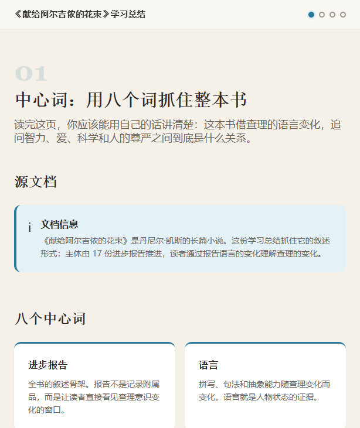

# Document to Study Summary

`document-to-study-summary` is a Codex skill that turns documents into concise, source-grounded study summary pages.

It is designed for fast understanding and teach-back: after reading the generated page, the learner should be able to explain the document in their own words.

## What It Does

Use this skill when you want to turn a PDF, DOCX file, Markdown note, article, report, novel, manual, existing course, or document folder into a compact learning summary.

The generated summary focuses on:

- central words and themes
- inferred reading purpose and learner outcome
- the document's logic or narrative storyline
- key turns where understanding changes
- longer dialogue-style explanation
- a fixed misread-risk section
- memory anchors, with Xiaohei-style images only when they help retelling and are explicitly requested
- an interactive retell mode with 30-second, 2-minute, and 5-minute teach-back scaffolds

It is intentionally shorter than a full course. If `document-to-course` is for learning step by step, this skill is for quickly grasping the document and retelling it clearly.

## Example Output

The screenshot below shows a summary generated from *Flowers for Algernon*.



The page starts with a small set of center words, then connects them into a storyline, uses a longer dialogue to resolve likely misunderstandings, and ends with a practical retell scaffold.
It also identifies the learner's reading purpose, uses visuals as memory anchors rather than decoration, warns against shallow misreadings, and gives the learner a small workspace to rehearse the explanation in their own words.

## Skill Contents

```text
document-to-study-summary/
  SKILL.md
  agents/
    openai.yaml
  references/
    _base.html
    _footer.html
    analysis-and-center-words.md
    build.sh
    main.js
    page-design.md
    purpose-and-modes.md
    styles.css
    teach-back.md
    xiaohei-visuals.md
```

## Install

Clone the repository:

```powershell
git clone https://github.com/quseijuro-design/document-to-study-summary.git
cd document-to-study-summary
```

Copy the skill files into your Codex skills directory:

```powershell
$target = "$env:USERPROFILE\.codex\skills\document-to-study-summary"
New-Item -ItemType Directory -Force $target | Out-Null
Copy-Item -Recurse -Force .\SKILL.md, .\agents, .\references $target
```

Then invoke it with:

```text
$document-to-study-summary 把这个文档变成我能快速理解并复述的学习总结页
```

## Example Prompts

```text
$document-to-study-summary 分析这本 PDF，让我能用自己的话讲出来
```

```text
$document-to-study-summary 把这个课程压缩成学习总结页
```

```text
$document-to-study-summary 提取这篇文章的中心词语，并按逻辑剧情线串起来
```

## Output Shape

The skill typically creates a browser-openable directory like:

```text
summary-name/
  styles.css
  main.js
  _base.html
  _footer.html
  build.sh
  modules/
    01-purpose-center-words.html
    02-storyline.html
    03-dialogue.html
    04-misread-risks.html
    05-retell-mode.html
  index.html
```

The final `index.html` opens directly in a browser. No dev server is required.

## Design Principles

- Keep every substantive point grounded in the source.
- Infer the learner's reading purpose and adapt the summary emphasis.
- Avoid rebuilding copyrighted long-form works as substitutes for the original.
- Extract center words by meaning, not just frequency.
- Show the logic or narrative movement before details.
- Use dialogue to clarify confusion, not as decoration.
- Treat visuals as memory anchors tied to center words, storyline turns, misread risks, or retell prompts.
- Use responsive visual argument maps for abstract concepts instead of forcing every document into a linear flow.
- Keep four peer cards in a balanced two-by-two layout on desktop/tablet, then collapse them cleanly on mobile.
- Style chat controls, retell prompts, checklist cards, score panels, and comparison callouts as part of the page instead of leaving browser-default controls.
- Keep learner-facing copy about the document itself; do not leak implementation notes such as layout, CSS, components, or fixed grid choices into the summary page.
- Always include a "do not misread this" section.
- End with an interactive retell mode so the learner can rehearse their own explanation.
- Keep the learner-facing page free of raw source tags, page-number markers, and metadata labels.
- Do not show a Xiaohei shot list by default; generate Xiaohei-style images only when the user explicitly asks for them.
- End with teach-back scaffolds so the learner can retell the document.

## Validation

Validate the skill folder with:

```powershell
python "$env:USERPROFILE\.codex\skills\.system\skill-creator\scripts\quick_validate.py" .
```
